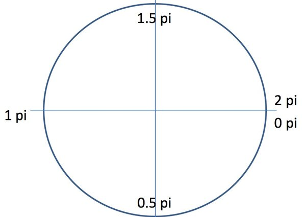
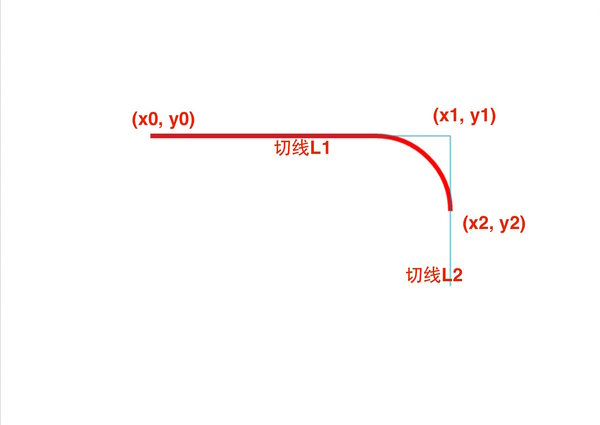

# canvas_please

## simple

* < canvas> < /canvas> 创建画布
* canvas.getContext("2d") 获取画笔
* moveTo(x, y) 移动画笔
* lineTo(x, y) 划线移动
* beginPath() 设置绘制状态起始点

* stroke() 绘制

* strokeStyle(color) 绘制颜色
* lineWidth(width) 绘制线粗细

## rect

* closePath() 设置绘制状态终点
* fill() 填充
* fillStyle(color) 填充颜色
* rect(x, y, width, height) 绘制矩形

## line

* lineCap  线的帽子，规定一条线的两端如何处理
  * butt：默认值，端点是垂直于线段边缘的平直边缘。
  * round：端点是在线段边缘处以线宽为直径的半圆。
  * square：端点是在选段边缘处以线宽为长、以一半线宽为宽的矩形。

* lineJoin 规定两条线交叉处如何处理
  * miter：默认值，在连接处边缘延长相接。miterLimit 是角长和线宽所允许的最大比例(默认是 10)。
    * miterLimit 规定一个自动填充连接点的极限值
  * bevel：连接处是一个对角线斜角。
  * round：连接处是一个圆。

## fillColor

* 线性渐变 （定义一条线渐变，辐射两边）
  * var grd = context.createLinearGradient(xstart,ystart,xend,yend);
  * grd.addColorStop(stop,color);  stop为断点，0-1的浮点数
  * context.fillStyle = grd;  应用渐变
  * context.strokeStyle = grd; 应用渐变

* 快速绘制矩形
  * ctx.strokeRect(x, y, width, height)
  * ctx.fillRect(x, y, width, height)

* 径向渐变 （相当于两个圆间的渐变）
  * var grd = context.createRadialGradient(x0,y0,r0,x1,y1,r1);
  * 同线性渐变

## fillStyle(填充纹理) 图案的重复

* createPattern(img,repeat-style)  img还可为canvas或video对象
  * var pattern = context.createPattern(img,"repeat");
  * context.fillStyle = pattern;

## arc 圆弧

* context.arc(x,y,radius,startAngle,endAngle,anticlockwise)  有点相当于lineTo
  * startAngle 开始弧度值，参考下图
  * endAngle  结束弧度值，参考下图
  * anticlockwise  绘制方向，true or false

* arcTo(x1,y1,x2,y2,radius)  两个切点坐标和圆弧半径

